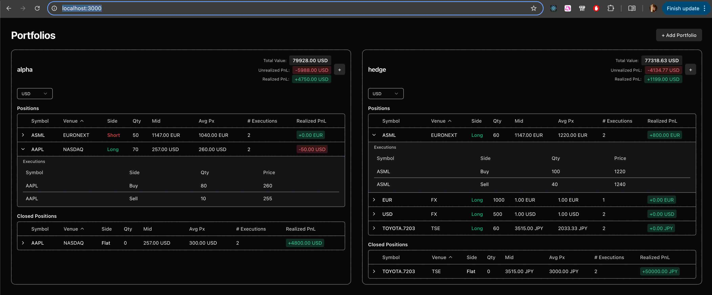

# Portfolio InCommodities
<p align="center">
  
</p>

## Overview 
The following repo contains the Portfolio implementation assignment for InCommodities implemented with `Rust` and `React`.

### Portfolio Calculations
- `fn calc_total_unrealized_pnl()`: Calculates the total unrealized pnl for all open positions in the portfolio for target currency.
- `fn calc_total_realized_pnl()`: Calculates the total realized pnl from closed positions for target currency.
- `fn calc_total_value()`: Calculates the notional for each position in the portfolio for target.

### Checklist
- [x] **Multi-Asset Support**: Handles currency assets and foreign stocks.
- [x] **Multi-Currency Valuation**: Handled by `fn calc_total_value()`, calculates the valuation by converting all positions into target `Currency`.
- [x] **Portfolio Consolidation**: Handled during execution processing in `fn on_exec()` by aggregating executions into `Position`(s) and updating the avg weighted mean.

## Quick Start
The easiest way to run the portfolio is using `make`. This starts the Rust backend which serves both the REST API and  the static UI files on `http://localhost:3000`.

```bash
make
```

### Running UI 
If you wish to run the UI with vite in dev mode, you can do so with `Bun` or `Node`. 

```bash
cd ui

# Bun
bun install
bun dev

# Node
npm install
npm run dev
```

To build and package the UI into `ui/dist`:

```bash
cd ui

# Bun
bun run build

# Node
npm run build
```

## Tech Stack
- **UI**: SPA built with `React`, `Vite (build runtime)`, `TailwindCSS`, and `shadcn/ui`.
- **Backend**: REST API developed with `Rust`, using `Axum` and `Tokio`.
- **Portfolio Logic**: Core portfolio logic with `Rust`, implemented to be `runtime-agnostic`.

### Structure

```text
├── Makefile                - Makefile to build and start 
└── src/
    ├── main.rs             - REST Server entry point 
    ├── handler.rs          - REST request handlers 
    ├── types.rs            - REST request/response types
    └── portfolio/    
        ├── mod.rs          - Portfolio and aggregate PnL logic
        ├── position.rs     - Position tracking, math, and snapshot logic
        ├── seed.rs         - Seed/Mock market data and initialization
        └── types.rs        - Domain types (execution, position, and instruments)
```

## Overview on Implementation. 
- **Instrument**: The source of truth for financial asset definition, I.E. AAPL stock, EUR/USD cash). 
- **Execution**: Canonical unit transaction for positions. A filled order record (Buy/Sell) for an Instrument. It contains the price and quantity. 
- **Position**: An aggregate of Executions for an Instrument. It tracks the direction, quantity, weighted average price, and PnL.
- **Portfolio**: Manages multiple Positions.

### Relationships 
- **Portfolio** processes **Executions**.
- **Executions** are matched to a **Position** based on its **Instrument**. Each position stores the execution.
- **Position** changes — opening, closing, or flipping are driven only by **Execution**.
- A netting of a position indicates closing of a position. Closing of a position creates a position snapshot and stored in **Portfolio**.


### Position Lifecycle
- (New) Position is automatically created for a new execution in portfolio for that instrument.  
- (Update) Position updates states such as qty, and avg price.
- (Close) Position closes when the quantity netts and a snapshot is created.
- (Flip) Position flips (changes direction) when an execution on the opposite side exceeds the current quantity.

#### Long
Exec (Buy 100) -> Pos (Long 100)
Exec (Sell 40) -> Pos (Long 60)
Exec (Sell 60) -> Pos (Nett) -> Snapshot (r_pnl)

#### Short 
Exec (Sell 100) -> Pos (Short 100)
Exec (Buy 40)   -> Pos (Short 60)
Exec (Buy 60)   -> Pos (Nett) -> Snapshot (r_pnl)

#### Flip - change directions
Exec (Buy 100)  -> Pos (Long 100)
Exec (Sell 150) -> Snapshot (r_pnl) -> Pos (Short 50)

## Limitations
- Persistence: Everything is in-memory and market data is static. 
- Fees: Are not accounted for.
- Precision: All positions are calculated in f64 instead of fixed precision for simplicity. 
- Position Events: Current setup doesn't handle stock split, dividend, and funding rates  
- Crypto: Not supported for inverse calculation.

## AI Usage
- **Backend** Domain design and core logic refined via AI feedback loops and code reviews.
- **UI** ~50% "vibe-coded" 🙏.


 
